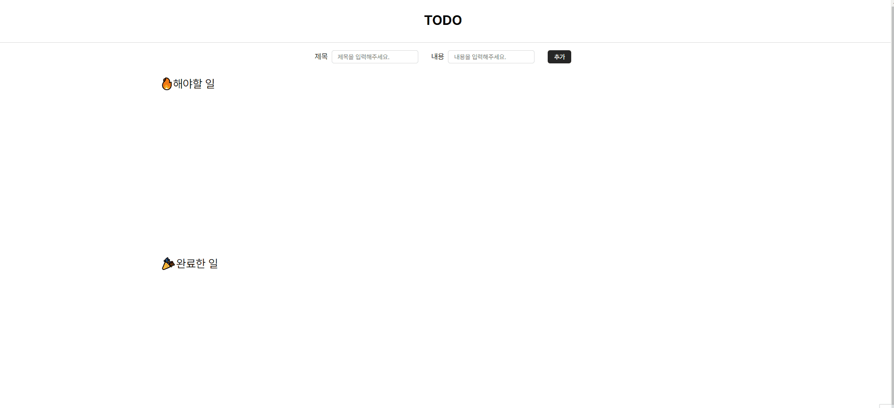
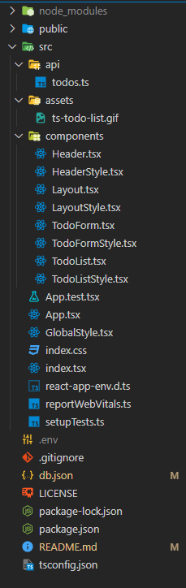

# react + typescript todo list 구현하기

## 프로젝트 소개
- react + typescript를 활용하여 todo list를 구현하는 프로젝트 입니다.
- 개발 기간 : 2024. 03.05 ~ 2024.03.06
- 배포 링크 [**바로가기**](https://ts-todo-list-self.vercel.app/)

</br>

## 💻️ 개발 환경
- Environment : vscode, github

- Development : React, typescript

- Database : json-server

- Library : styled-components, react-query, json-server, 

- Deployment : Vercel, Glitch(json-server)

</br>

## ❗ 기능 소개

#### CRUD
- todo 등록 및 완료 여부 상태 변경, 삭제 기능을 구현하였습니다.

<br/>

## 🚩시작 가이드

```
$ git clone https://github.com/jigico/ts-todo-list.git
$ npm install
```
<br/>

## 📃 페이지 미리보기
 <br>

## 프로젝트 구조
- 컴포넌트의 이름을 통일성 있게 지정하여 1뎁스에서 보기 쉽도록 하고자 하였습니다.

